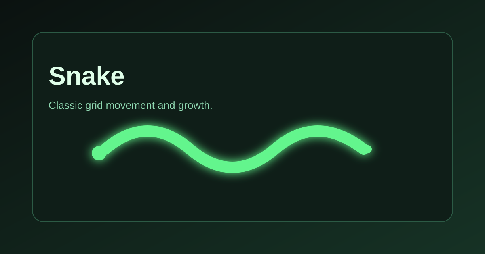
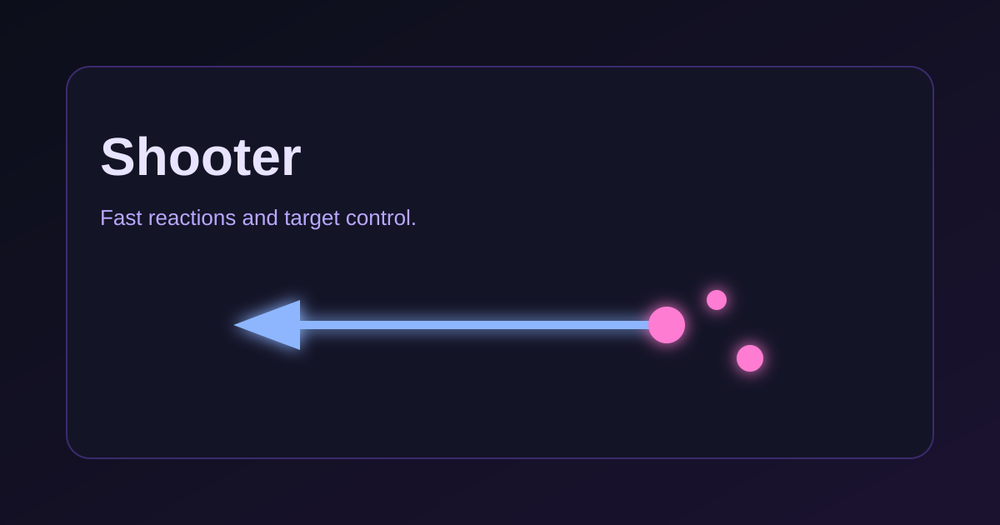

# Unblocked Games Page 🎮

A lightweight, single‑page hub for a small set of browser games. Everything is static HTML/CSS/JS, so it runs locally with no build step.

## Quick Start 🚀

1. Open `index.html` in your browser.
2. Click a game tile to launch it.

## Run With a Local Server (Recommended) 🧠

Some browsers restrict local file access. A tiny local server avoids that.

- Python:
  - `python3 -m http.server 8080`
- Node:
  - `npx serve .`

Then visit:

- `http://localhost:8080`

## Game Thumbnails 🕹️

### Snake 🐍

### Shooter 🔫

## Project Structure 🧩

- `index.html` — Landing page and game launcher.
- `snake-game.html` — Snake game.
- `shooter-game.html` — Shooter game.

## Customize ✨

- Update branding, colors, and layout in `index.html` under the `<style>` block.
- Add a new game by duplicating an existing game file and linking it from `index.html`.

## Notes 📌

- This project is static and does not require any dependencies.
- Works best on modern desktop and mobile browsers.
